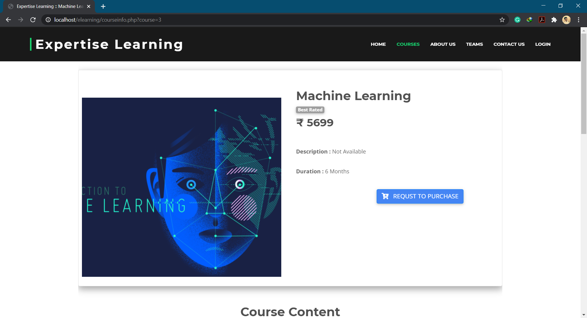
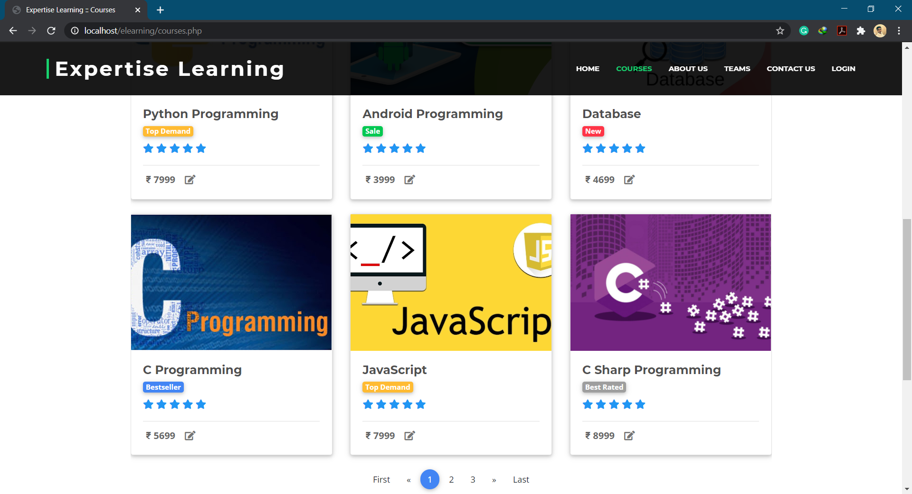

  

# E-Learning System
> It is a completely customized solution for the tutorials which will help eradicate use of papers, pens, and manage digital learning thus providing it with an edge over its competitors

## Snapshot of the project

## Contributing

1. Fork [Expertise Learning](https://github.com/tauseefansari/Expertise-Learning-Certification-Website)
2. Create your feature branch (`git checkout -b feature/fooBar`)
3. Commit your changes (`git commit -am 'Add some fooBar'`)
4. Push to the branch (`git push origin feature/fooBar`)
5. Create a new Pull Request
